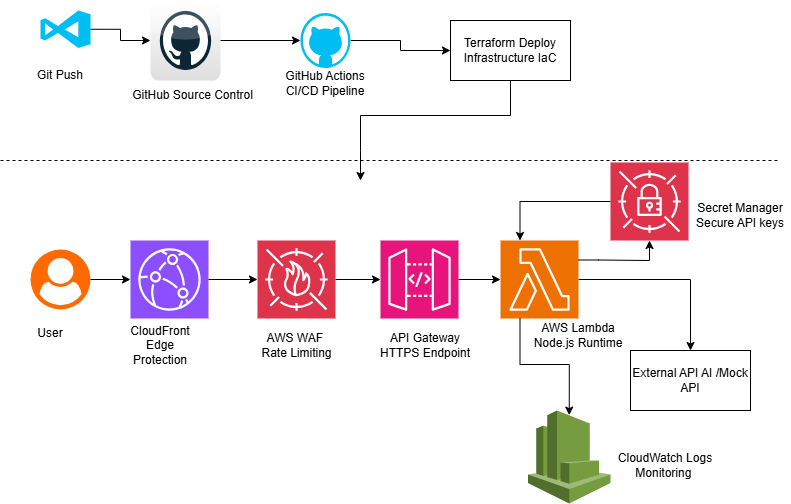

# AWS Secure AI API Project

## Overview

This project is a hands-on cloud security and serverless API portfolio project built using AWS and Terraform.

The project demonstrates how to build and secure a modern cloud-native API architecture using:

- AWS Lambda
- API Gateway
- CloudFront
- AWS WAF
- AWS Secrets Manager
- CloudWatch
- Terraform
- GitHub Actions CI/CD

The main goal of the project is to combine:

- cloud engineering
- infrastructure automation
- security best practices
- monitoring
- CI/CD workflows

into a practical real-world learning project.

This project follows a top-down learning approach:

```text
Build real projects → learn required concepts during implementation
```

---

# Architecture Diagram



---

# Architecture Flow

```text
Developer
   ↓
GitHub Repository
   ↓
GitHub Actions CI/CD
   ↓
Terraform Deployment
   ↓
CloudFront
   ↓
AWS WAF
   ↓
API Gateway
   ↓
AWS Lambda
   ↓
Secrets Manager + CloudWatch
   ↓
External API
```

---

# Technologies Used

## Cloud Services

- AWS Lambda
- AWS API Gateway
- AWS CloudFront
- AWS WAF
- AWS CloudWatch
- AWS Secrets Manager
- AWS IAM

## Infrastructure as Code

- Terraform

## Programming

- Node.js
- JavaScript

## CI/CD

- GitHub Actions

## Version Control

- Git
- GitHub

---

# Security Features

This project focuses heavily on practical cloud security concepts.

## Implemented Security Controls

- AWS WAF provides API rate limiting protection
- IAM permissions follow least privilege principles
- Secrets are stored securely in AWS Secrets Manager
- CloudWatch provides operational monitoring
- Infrastructure is managed using Terraform
- No hardcoded credentials are stored in GitHub
- HTTPS endpoints are used for secure communication
- CloudFront provides edge-layer protection

---

# CI/CD Pipeline

GitHub Actions automatically deploys infrastructure after code changes are pushed to GitHub.

The pipeline performs:

- Terraform initialization
- Terraform validation
- Terraform planning
- Terraform deployment

## CI/CD Workflow

```text
Git Push
   ↓
GitHub Actions
   ↓
Terraform Apply
   ↓
AWS Infrastructure Deployment
```


---

# Terraform Deployment

## Prerequisites

Install the following tools:

- Terraform
- AWS CLI
- Node.js
- Git

Configure AWS credentials:

```bash
aws configure
```

---

## Deploy Infrastructure

Navigate to Terraform directory:

```bash
cd terraform
```

Initialize Terraform:

```bash
terraform init
```

Preview changes:

```bash
terraform plan
```

Deploy infrastructure:

```bash
terraform apply
```

Destroy infrastructure when finished:

```bash
terraform destroy
```

---

# Lambda Packaging

The Lambda deployment package must be rebuilt after updating Lambda code.

From project root:

```powershell
Compress-Archive -Path lambda/* -DestinationPath lambda.zip -Force
```

---

# API Testing

After deployment, Terraform outputs the API endpoint.

Example:

```text
https://YOUR_API_ENDPOINT/prod/hello
```

Or through CloudFront:

```text
https://YOUR_CLOUDFRONT_DOMAIN/hello
```

Example response:

```json
{
  "message": "CI/CD deployment successful"
}
```

---

# Monitoring

CloudWatch is used for:

- Lambda logging
- Error monitoring
- Runtime troubleshooting
- Operational visibility

## Monitored Metrics

- Lambda invocations
- Lambda errors
- Execution duration
- API request activity

## CloudWatch Log Group

```text
/aws/lambda/ai-security-demo
```

---

# WAF Protection

AWS WAF provides basic API protection.

## Current WAF Features

- Rate limiting
- Request filtering
- Edge protection using CloudFront

Example protection rule:

```text
Block excessive requests from a single IP address
```

---

# Project Structure

```text
aws-ai-security-project/
│
├── .github/
│   └── workflows/
│       └── deploy.yml
│
├── images/
│   ├── architecture.png
│   ├── github-actions.png
│   ├── cloudwatch.png
│   └── waf.png
│
├── lambda/
│   ├── index.js
│   ├── package.json
│   └── package-lock.json
│
├── terraform/
│   ├── main.tf
│   ├── outputs.tf
│   └── variables.tf
│
├── architecture.drawio
├── lambda.zip
├── README.md
└── .gitignore
```

---

# Lessons Learned

This project helped develop practical hands-on experience across cloud engineering, infrastructure automation, security, monitoring, and DevSecOps workflows.

## Terraform Infrastructure as Code (IaC)

- Provisioned AWS infrastructure using Terraform
- Built reusable infrastructure definitions
- Learned Terraform workflows:
  - terraform init
  - terraform plan
  - terraform apply
  - terraform destroy
- Learned Terraform state management concepts
- Troubleshot Terraform deployment and dependency issues

## AWS Serverless Architecture

- Built a serverless API architecture using:
  - API Gateway
  - Lambda
  - CloudFront
- Learned how serverless applications operate
- Integrated API Gateway with Lambda functions
- Deployed Node.js applications to AWS Lambda

## IAM Least Privilege Design

- Learned differences between managed and custom IAM policies
- Implemented least privilege permissions
- Restricted Lambda access to only required services
- Developed understanding of IAM trust relationships

## Cloud Security Principles

- Implemented:
  - AWS WAF
  - Secrets Manager
  - IAM security controls
  - HTTPS APIs
- Learned secure secret handling practices
- Developed a stronger cloud security mindset

## CI/CD Pipeline Automation

- Built GitHub Actions deployment pipeline
- Automated Terraform deployments
- Learned Git-based infrastructure workflows
- Improved understanding of deployment automation

## Monitoring and Observability

- Configured CloudWatch Logs
- Monitored Lambda runtime behavior
- Troubleshot runtime and deployment issues
- Learned operational monitoring concepts

## GitHub Workflow Management

- Improved Git and GitHub workflow understanding
- Learned repository hygiene best practices
- Fixed issues involving:
  - Terraform provider binaries
  - Terraform state files
  - generated dependencies
- Learned proper .gitignore usage

## Cloud Troubleshooting and Debugging

- Troubleshot:
  - Lambda runtime errors
  - API Gateway integration issues
  - CloudFront configuration issues
  - WAF integration problems
  - Terraform deployment failures
- Developed practical cloud debugging skills

---

# Future Improvements

Planned future enhancements include:

- Real AI API integration
- Advanced WAF managed rules
- Custom domain with ACM
- Structured JSON logging
- SNS alerting integration
- Multi-environment Terraform setup
- Terraform remote backend
- Advanced monitoring dashboards
- Security hardening review
- Additional least-privilege IAM refinement

---

# Portfolio Objective

This project is designed to demonstrate practical experience relevant to:

- Cloud Engineer
- DevSecOps Engineer
- Cloud Security Engineer
- Platform Engineer
- Security-focused System Administrator

---

# Author

Built as a continuous hands-on cloud security learning project using:

- AWS
- Terraform
- GitHub
- Node.js
- GitHub Actions